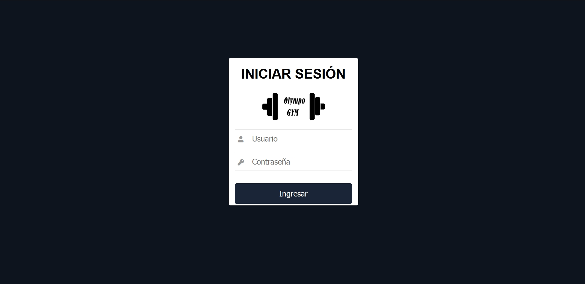
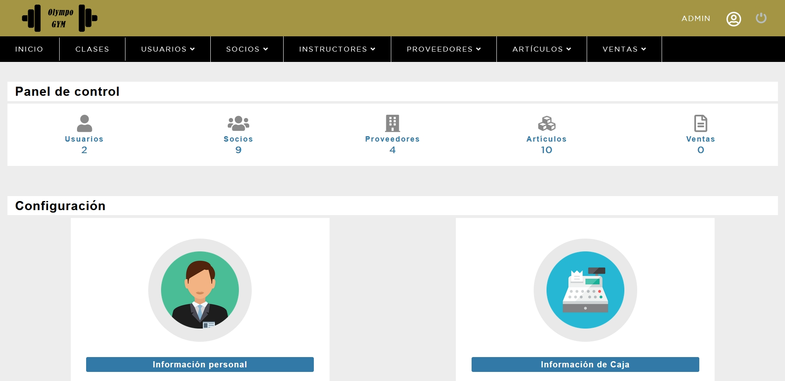

# Sistema de gestión "Olympo GYM"

## Descripción

"Olympo GYM" es un sistema de gestión de datos para gimnasios, el cual permite utilizar la información necesaria en las tareas principales dentro de un gimnasio.
El mismo cuenta con módulos para registrar, modificar y eliminar datos. Como también para realizar ventas de articulos y clases deportivas. Además cuenta con registro en tiempo real sobre las actividades de caja, es decir, los movimientos de dinero al momento de procesar una venta. 

El sistema contiene dos tipos de roles de acceso:
* Administrador
* Vendedor

Los cuales son asignados al momento de registrar un nuevo usuario, los mismos presentan módulos diferentes, en los cuales se enfocan en la función que tendrán en el sistema. Para acceder, el usuario debe estar registrado previamente por el administrador, el cual le asignará un usuario y contraseña.


> Pantalla de Login

La pantalla principal del sistema depende del tipo de rol del usuario, ya que las opciones varian de acuerdo a la función que tendrá el mismo.  


> Pantalla principal

## Instalación

Tener el servidor web Apache y un sistema de gestión de base de datos (XAMPP/LAMP/MAMP).

* Crear una base de datos

```
create database gimnasio
```

* Cargar el código del archivo **BD_gimnasio.sql**

* Modificar el archivo **conexion.php**

```
// verificar el usuario, contraseña, y el nombre de la base de datos creada, en la línea 4
$conexionDB = new mysqli("localhost", "root", "", "gimnasio");
```

* Mover los archivos a la carpeta de lectura del servidor

## Recursos

Se utilizó la biblioteca fpdf para los reportes en formato excel y pdf.

* http://www.fpdf.org/